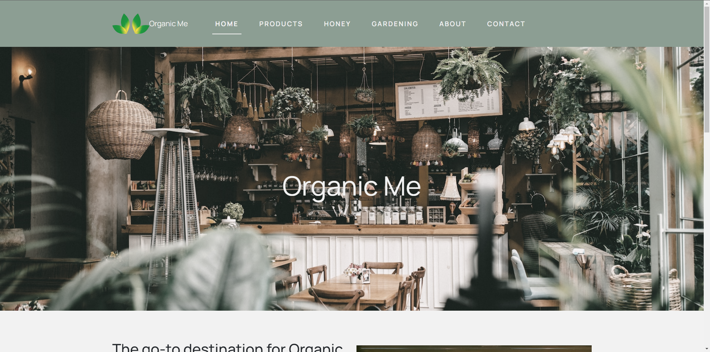

# Organic Me

A responsive website for a hypothetical organic café built with HTML, CSS, JavaScript, and Bootstrap.

## Project Overview

Organic Me was my first experience using Bootstrap CSS in a web project. I created this responsive website for a hypothetical organic café, implementing key Bootstrap components like the navbar, grid system, and cards.

While simple in structure, this project allowed me to solve real layout challenges and learn how to customize Bootstrap's utility classes within a live environment. The site features a functional contact form, embedded media elements, and ScrollReveal.js animations that enhance the user experience.

## Development Notes

This was my first proper web development project, which focused on implementing Bootstrap's utility classes in a real-world scenario. The project gave me hands-on experience with:

- Responsive design principles
- Mobile-first development
- Implementation of third-party libraries (via a CDN)
- Basic form handling
- Media embedding techniques

The project's simplicity allowed me to focus on mastering the fundamentals before moving on to more complex concepts later in college.

## My Thoughts

Today, I would approach this differently, using vanilla CSS and creating reusable code snippets. Still, this initial project sparked my passion for web development and established my foundation in responsive design.
I look back on this project with a sense of beginning, and I use it as a benchmark to see how far I have come in my Web dev & Design journey.

## Key Technologies

- HTML5
- CSS3 (Bootstrap framework)
- JavaScript
- ScrollReveal.js for scroll animations
- HTML video tag implementation
- YouTube video embedding
- Responsive contact form

## Live Demo

You can view the live project [here]([http://webdev.edinburghcollege.ac.uk/~HNCWEBMR11/Organic%20Me/Index.html](http://webdev.edinburghcollege.ac.uk/HNCWEBMR11/Organic%20Me/Index.html) or check out the code in the repository.

